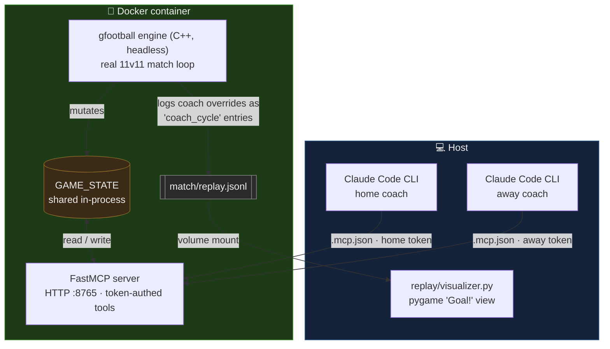

# agentic-soccer

**AI agents coach a real 11v11 football match — then you watch it back in retro 16-bit.**

`agentic-soccer` runs an actual [gfootball](https://github.com/google-research/football)
(Google Research Football) match — the real C++ engine, headless, in Docker. A
[Model Context Protocol](https://modelcontextprotocol.io) (MCP) server exposes live match
state and accepts player overrides. Two **Claude Code CLI sessions** connect as opposing team
coaches: they read the game in plain language, decide tactics, and steer individual players —
no SDK, no API loop, just a model reading the pitch and reacting. Every coaching decision is
logged, and the whole match is replayed in a pygame viewer styled after Jaleco's *Goal!* — the
angled, skewed-perspective 16-bit look from the Super Famicom era.

## What it demonstrates

- A real football engine driven live by LLM agents over MCP.
- Two independent, **token-scoped** coaches (home vs. away) writing to the same simulation
  without seeing each other's tools.
- Plain-language decision logs (the coach's reasoning) recorded alongside the match for
  inspection and replay.
- A self-contained, deterministic replay format you can watch on the host.

## Architecture



- **Simulator + MCP server** run together in one Docker process because they share the
  in-process `GAME_STATE` singleton: the engine mutates it, the MCP tools read/write it.
- **Coaches** are two Claude Code CLI sessions. Each loads the `soccer-coach` skill and
  connects to its own token-scoped MCP server (`home` or `away`) declared in `.mcp.json`.
- **Replay viewer** runs on the host (it needs a display), reading `match/replay.jsonl`,
  which is written into a mounted `match/` directory.

## Quickstart

You need **Docker** (the gfootball C++ engine does not build natively on macOS arm64 — see
[Platform notes](#platform-notes)). Python tooling is managed with [`uv`](https://docs.astral.sh/uv/).

**1. Build the image** (first build compiles gfootball's C++ engine; takes several minutes):

```bash
./run_docker.sh build
```

**2. Run a match.** This starts the gfootball engine + MCP server on port `8765` and writes
the replay to `./match/replay.jsonl`. The engine plays a full autonomous match on its own, so
this works standalone — coaches are optional:

```bash
./run_docker.sh up
```

**3. Watch the replay** in the pygame viewer (on the host):

```bash
make replay
# equivalent to: uv run --no-sync python -m replay.visualizer match/replay.jsonl
```

Verify gfootball actually runs inside the container at any point with `./run_docker.sh verify`.

## Watch it

The replay is rendered in a **Jaleco *Goal!*-inspired** style: a steep skewed-perspective
pitch (vertical lines lean diagonally with depth), large 3-tone shaded player sprites with
run-cycle animation, detailed goal nets, a bright mown pitch, a bottom HUD (team codes, big
outlined score digits, match clock), and an active-player marker. When a coach issues an
override, a ⚡ **COACH** banner flashes and the affected player glows.

Playback controls: **SPACE** pause/resume · **←/→** step frames · **+/-** speed · **ESC** quit.

Pitch coordinates: `x ∈ [-1, 1]` (x=-1 home goal line, x=+1 away goal line),
`y ∈ [-0.42, 0.42]`. Generated sprite assets live under `replay/assets/sprites/` and are
checked in (the viewer needs them).

## The five milestones

`entrypoints/run_milestones.py` (run in-container) drives a full end-to-end pass
and `entrypoints/check_milestones.py` reports how many of these five gates pass (0–5):

| # | Milestone |
|---|-----------|
| **M1** | Headless match runs to completion with a score. |
| **M2** | MCP server starts and `get_match_status` returns narrator text. |
| **M3** | `replay.jsonl` exists and has at least one `coach_cycle` entry. |
| **M4** | Two token-scoped MCP connections (home + away) work simultaneously. |
| **M5** | The pygame replayer launches and loads `replay.jsonl` without crashing. |

Run the full milestone harness inside the built image:

```bash
docker compose run --rm soccer python -m entrypoints.run_milestones
```

## How the coaching works

Each coach is a Claude Code CLI session running the [`soccer-coach`](.claude/skills/soccer-coach/SKILL.md)
skill, pointed at one team's MCP server (token-scoped, declared in `.mcp.json`):

- **home** → `soccer-sim-home` server · **away** → `soccer-sim-away` server.

The MCP tools (one server per team, scoped by token so a coach only ever sees its own side):

- `get_match_status(team)` — narrator text: clock, score, possession, and a
  `WHAT YOUR PLAYERS ARE DOING:` block (one line per player, squad-index order 0–10).
- `update_player_override(team, player_id, override)` — steer one player.
  `override = {"target_position": [x, y], "duration_ticks": N, "reasoning": "..."}`.
- `get_player_overrides(team)` — currently active overrides.
- `clear_player_override(team, player_id)` — cancel an override early.

Every override carries a plain-language `reasoning` string, and each coaching decision is
written into `match/replay.jsonl` as a `coach_cycle` entry — so the replay (and the file
itself) is a readable trace of *why* each tactical change was made.

## Platform notes

The gfootball engine is a C++ build (Boost.Python + SDL2 + OpenGL) that compiles cleanly on
Linux but **not** on macOS arm64 — Boost.Python is ABI-locked to the build interpreter,
Homebrew ships no `libboost_python312`, and CMake 4.x rejects gfootball's old policy
declarations. The `Dockerfile` (built on `ubuntu:24.04`, whose native Python *is* 3.12 and
whose apt Boost is built against it) sidesteps all three walls. The Dockerfile and
`pyproject.toml` comments document the exact workarounds. Host-side tests mock gfootball, so
they need no image.

## Tech

- **Python 3.12**, [`uv`](https://docs.astral.sh/uv/) for env/tooling
- **gfootball** (Google Research Football) — the real match engine
- **FastMCP** — token-authed MCP server (Streamable HTTP, port 8765)
- **pygame** — host-side 16-bit replay viewer
- **Docker** — runs the engine + MCP server

## Testing

Host-side tests mock gfootball, so no Docker image is required:

```bash
make test       # 94 tests (uv run --no-sync pytest -q)
make lint       # ruff check .
make typecheck  # mypy .
```

For the full in-Docker integration gate (real gfootball compiled in the image):

```bash
docker compose run --rm soccer python -m entrypoints.run_milestones
```

> Always use `uv run --no-sync` (the bare `make` targets already do): a plain `uv run`
> re-syncs the venv and triggers a slow gfootball C++ rebuild.

## License

[MIT](LICENSE) © 2026 cajias.

The replay's visual style is *inspired by* Jaleco's *Goal!*; no copyrighted assets from that
game are included in this repository.
